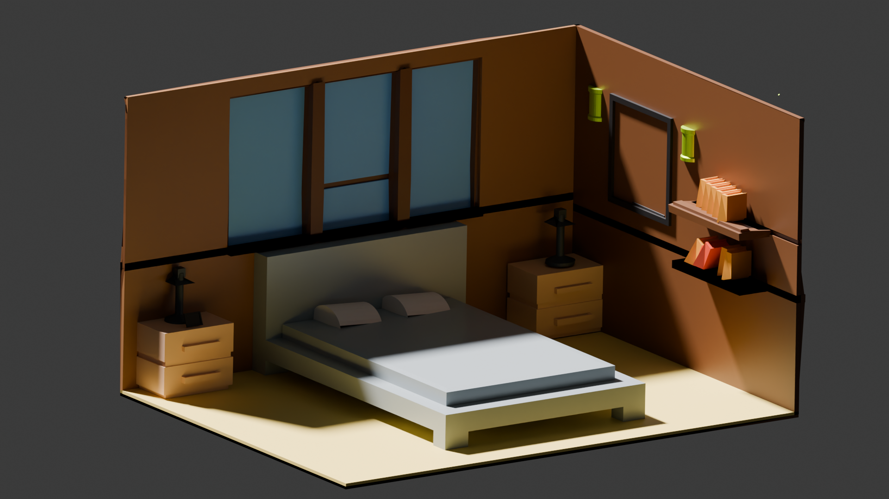

# 3D İzometrik Oda Tasarımı (Staj Projesi) 🏠

Bu proje, Software Persona bünyesindeki staj sürecimde Blender kullanılarak oluşturulmuş bir izometrik oda modellemesidir. Proje, temel mesh modelleme tekniklerinden final render aşamasına kadar tüm 3D üretim hattını (pipeline) kapsamaktadır.
Bu proje, TNC Group Şirketleri bünyesinde gerçekleştirdiğim stajın bir parçası olarak, teknik yönergelere ve teslim sürelerine sadık kalınarak tamamlanmıştır.

## 🛠 Teknik Detaylar
- **Modelleme:** Mesh modelleme (Extrude, Inset, Loop Cut teknikleri).
- **Modifier Kullanımı:** Bevel, Mirror ve Boolean modifier'ları ile optimize edilmiş geometri.
- **Materyal & Shading:** PBR (Physically Based Rendering) mantığıyla oluşturulmuş materyaller ve Shading Editor kullanımı.
- **Işıklandırma:** Üç noktalı ışıklandırma (Three-point lighting) ve Cycles/Eevee render motoru optimizasyonu.

## 📐 Proje Gereksinimleri (Yönergeye Uygunluk)
TNC Group tarafından belirlenen kriterler doğrultusunda:
- **5 Ana Obje:** (Örn: Yatak, Masa, Gardırop vb. senin modellediklerin) sıfırdan modellendi.
- **3 Yardımcı Obje:** Sahne detaylandırması için eklendi.
- **İzometrik Kamera:** Orthographic kamera açısı ile teknik derinlik sağlandı.

## 🖼 Render Çıktıları

*Projenin final halinden bir kesit.*

## 📂 Klasör Yapısı
- `/source`: `.blend` dosyası.
- `/renders`: Final render ve wireframe görüntüleri.
- `/docs`: Proje yönergesi ve teknik rapor.
